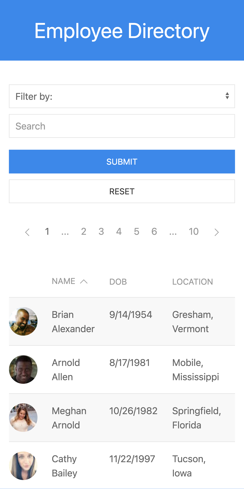
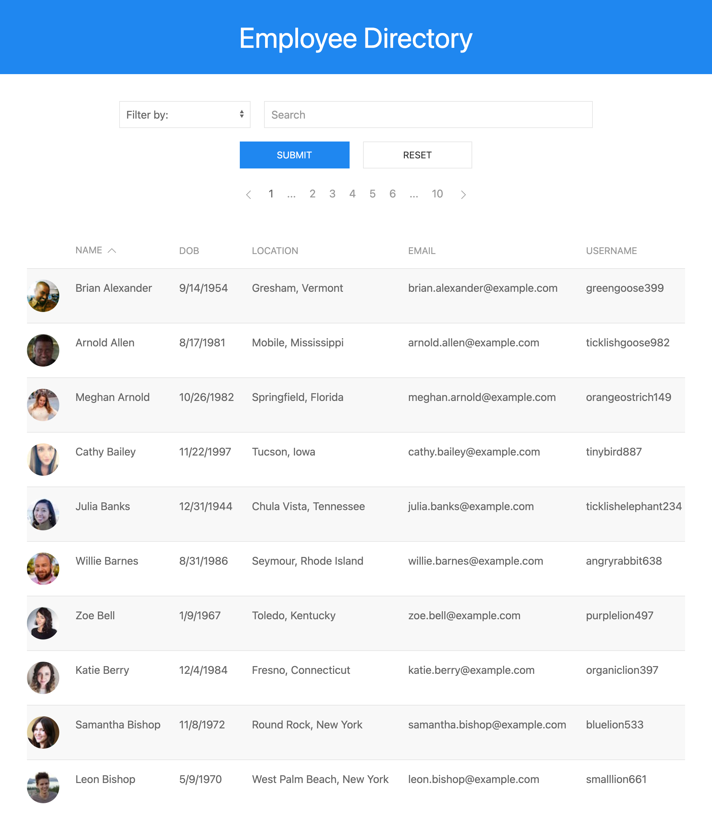

# Employee Directory

## Description

Mock of an employee directory using data from the Random User API. On initial page load, a table of employee information is rendered to the screen with employees listed in alphabetical order by last name. The table can be filtered using the search form at the top of the page. Additionally, the directory can be sorted by clicking on the various table headings to sort by the corresponding category. If more than 10 employees are displayed in the table, the user can utilize the pagination buttons above the table to view the next page of employees.

## Table of Contents

- [Views](#views)
- [Technology](#technology)
- [Questions](#questions)
- [License](#license)

## Views

### Mobile View

### Desktop View

## Technology

- React
- Formik
- Yup
- Axios
- UIKit
- Random User API

## Questions

Please feel free to contact via email if you have any questions pertaining to this project.  
Email: jkole822@gmail.com  
[GitHub Profile](https://github.com/jkole822)

## License

[MIT](https://choosealicense.com/licenses/mit)
